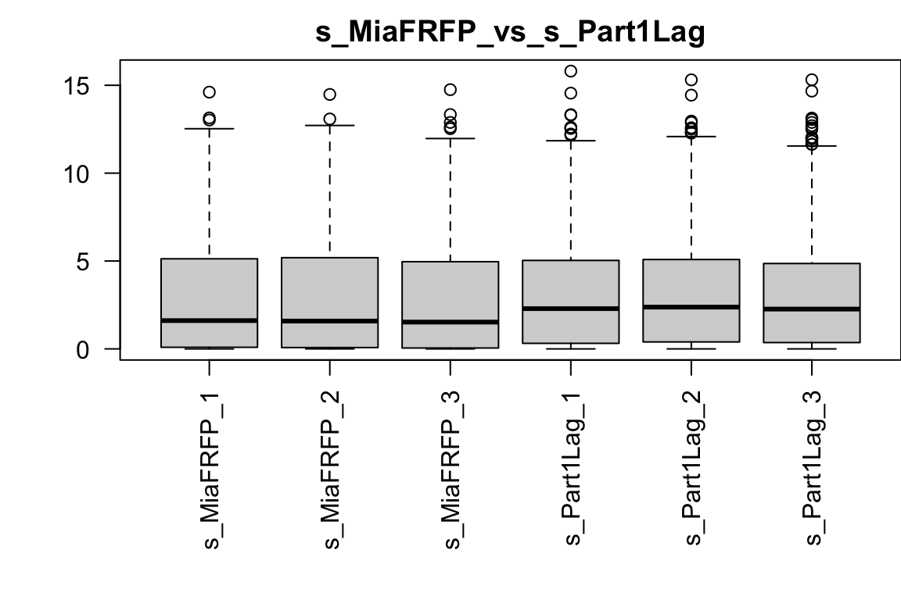
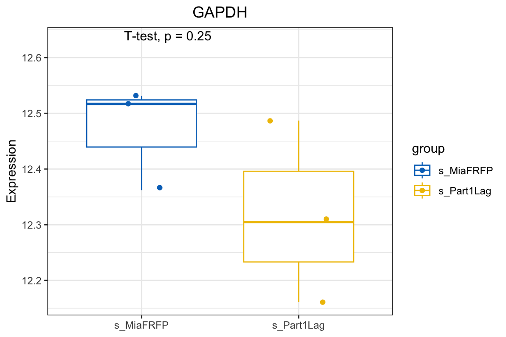
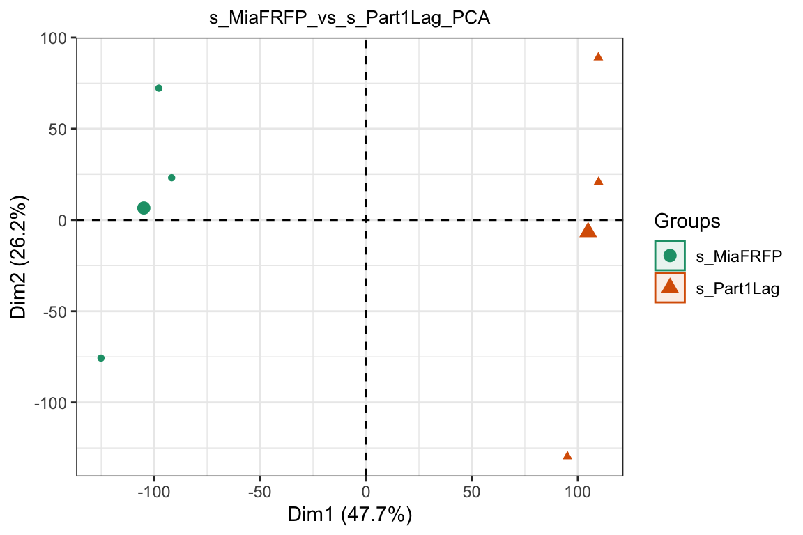
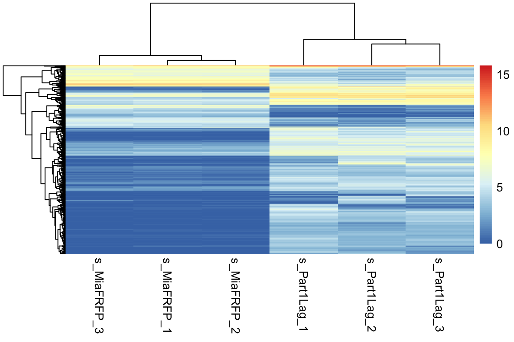
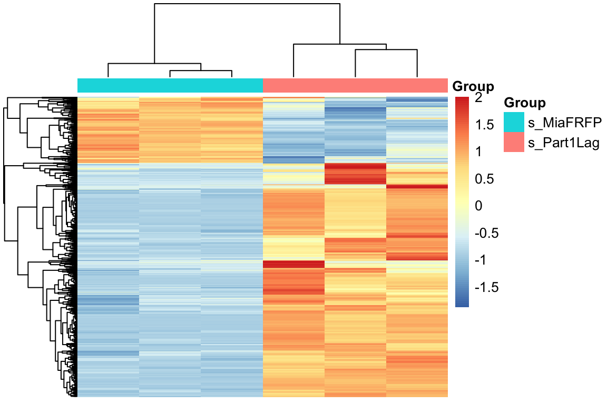
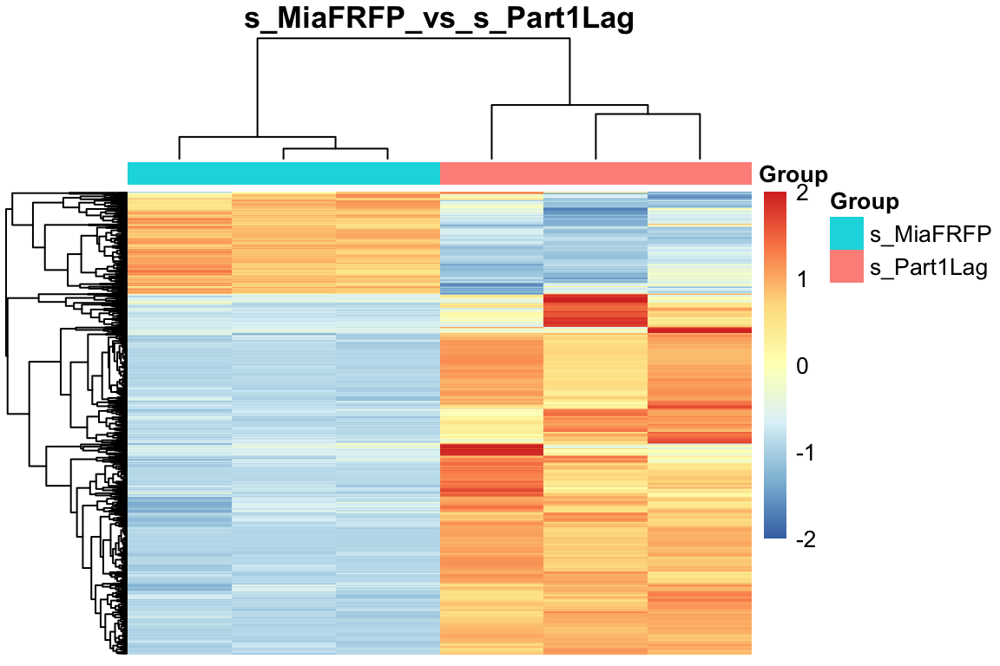
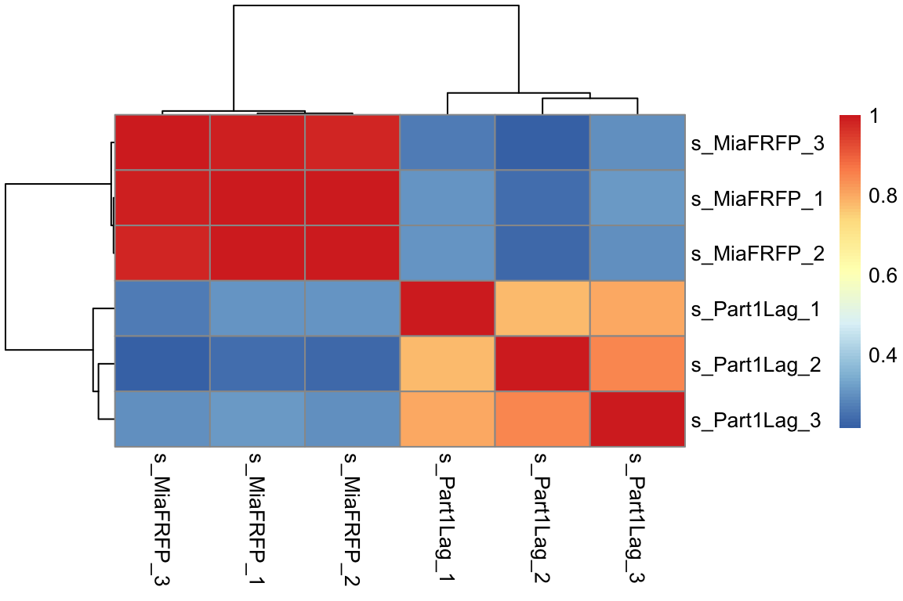
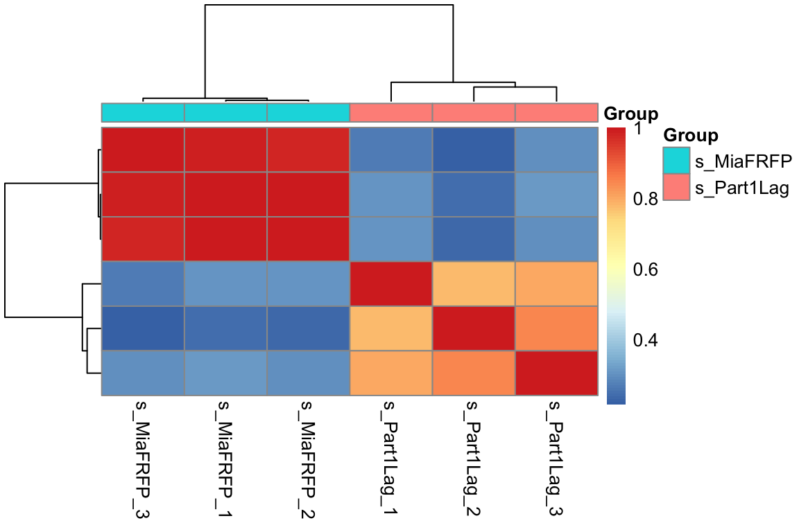
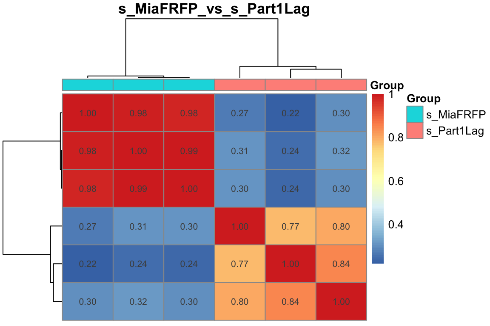
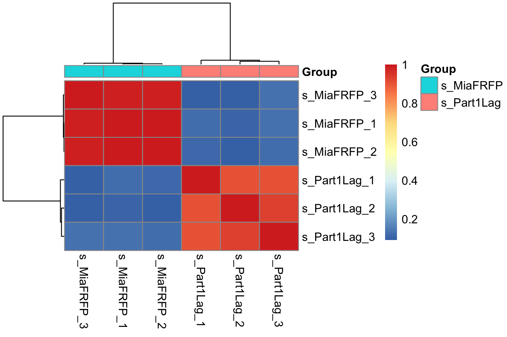

# (PART) 样本表达分布 {-}


# 样本表达分布

## 加载数据

``` r
# 加载包
library(tidyverse)
library(ggplotify)
library(ggview)
# 加载变量
load(file = 'Rdata/symbol_matrix.Rdata')
# cpm 归一化
dat = log2(edgeR::cpm(symbol_matrix)+1)
dat[1:4,1:4]
##        s_MiaFRFP_1 s_MiaFRFP_2 s_MiaFRFP_3 s_Part1Lag_1
## TSPAN6  0.03721777    0.000000    0.000000    0.0317213
## DPM1    5.71662319    6.098771    4.676184    6.4379710
## SCYL3   4.25132942    4.357822    3.828210    3.6224149
## FIRRM   5.22004517    5.615629    4.762597    4.6027733
pro = paste0(levels(group_list)[1], "_vs_", levels(group_list)[2]) # 希望的图Title
```

## 箱线图

``` r
par(mar = c(8,4,2,0))
boxplot(dat,las=2); title(pro)
```



也可以查看自己关注基因的表达情况

``` r
# 加载包
library(ggpubr)
# 以 GAPDH 基因为例
target_gene = "GAPDH"
# 提取数据
df <- data.frame(expression = dat[target_gene, ], group = group_list)

# 创建箱线图
ggboxplot(df, 
          x = "group", 
          y = "expression",
          color = "group", 
          palette = "jco",
          add = "jitter"
          ) +
  stat_compare_means(method = "t.test",
                     label.y = max(df$expression) + 0.1) +
  labs(title = target_gene, x = NULL, y = "Expression") +
  theme_bw() +
  theme(plot.title = element_text(hjust = 0.5))
```



``` r
  # canvas(10, 10, "cm")
```

## PCA

``` r
# 加载包
library("FactoMineR")
library("factoextra")

# 画PCA图时要求是行名时样本名，列名是基因名，因此此时需要转换
exp=as.data.frame(t(dat))
# PCA 计算
dat.pca <- PCA(exp , graph = FALSE)
# Tittle
this_title <- paste0(pro,'_PCA')

fviz_pca_ind(dat.pca,
             geom.ind = "point",  #c( "point", "text" )
             col.ind = group_list, # color by groups
             palette = "Dark2",
             addEllipses = TRUE, # Concentration ellipses
             legend.title = "Groups")+
  ggtitle(this_title)+
  theme_bw()+
  theme(plot.title = element_text(size=10 ,hjust = 0.5))
```



``` r
  # canvas(12, 10, "cm")
```

## 基因热图
取方差最大的1000个基因，然后画热图

``` r
# 加载包
library(pheatmap)
# 取方差最大的1000个基因
cg <- names(tail(sort(apply(dat, 1, sd)),1000))
# 画热图
par(mar = c(8,4,2,0))
pheatmap(dat[cg,],show_colnames =T,show_rownames = F) 
```



对这1000个基因进行归一化，然后画热图，以及添加分组信息

``` r
# 加载包
library(pheatmap)
# 取方差最大的1000个基因
cg <- names(tail(sort(apply(dat, 1, sd)),1000)) 
n <- t(scale(t(dat[cg,]))) # 'scale'可以对log-ratio数值进行归一化
n[n>2] = 2 # 所有大于2的值都变成2
n[n< -2] = -2 # 所有小于-2的值都变成-2
# 添加分组信息
ac <- data.frame(Group=group_list)
rownames(ac) <- colnames(n)
# 画热图
par(mar = c(8,4,2,0))
pheatmap(n,
         show_colnames = F,
         show_rownames = F,
         annotation_col= ac)
```



对这1000个基因进行归一化后，然后画区间热图，以及添加分组信息

``` r
# 加载包
library(pheatmap)
# 取方差最大的1000个基因
cg <- names(tail(sort(apply(dat, 1, sd)),1000)) 
n <- t(scale(t(dat[cg,]))) # 'scale'可以对log-ratio数值进行归一化
n[n>2] = 2 # 所有大于2的值都变成2
n[n< -2] = -2 # 所有小于-2的值都变成-2
# 添加分组信息
ac=data.frame(Group=group_list)
rownames(ac)=colnames(n)

# 画热图
par(mar = c(8,4,2,0))
pheatmap(n,
         show_colnames =F,
         show_rownames = F,
         main = pro,
         annotation_col=ac,
         breaks = seq(-2,2,length.out = 100) # 添加区间
         )
```




## 样本间相关性热图
取方差最大的1000个基因，做样本间相关性热图

``` r
# 加载包
library(pheatmap)
# 取方差最大的1000个基因
cg <- names(tail(sort(apply(dat,1,sd)),1000))
exprSet=dat[cg,]
par(mar = c(8,4,2,0))
pheatmap(cor(exprSet)) 
```



取方差最大的1000个基因，做样本间相关性热图，以及添加分组信息

``` r
# 组内的样本的相似性应该是要高于组间的！
colD <- data.frame(Group=group_list)
rownames(colD) <- colnames(exprSet)
pheatmap::pheatmap(cor(exprSet),
                   annotation_col = colD,
                   show_rownames = F)
```



取方差最大的1000个基因，做样本间相关性热图，以及添加分组信息,Title和相关性值

``` r
# 取方差最大的1000个基因
cg <- names(tail(sort(apply(dat,1,sd)),1000))
exprSet=dat[cg,]
colD <- data.frame(Group=group_list)
rownames(colD) <- colnames(exprSet)
pheatmap::pheatmap(cor(exprSet),
                   annotation_col = colD, # 添加分组信息
                   display_numbers = T, # 显示相关性值
                   show_rownames = F, 
                   show_colnames =F,
                   main = pro)
```



取中位数偏差最大的500个基因，做样本间相关性热图，以及添加分组信息

``` r
# 取中位数偏差最大的500个基因
exprSet_mad <- exprSet[names(sort(apply(exprSet, 1, mad),decreasing = T)[1:500]),]
pheatmap::pheatmap(cor(exprSet_mad), 
                   annotation_col = colD)
```


