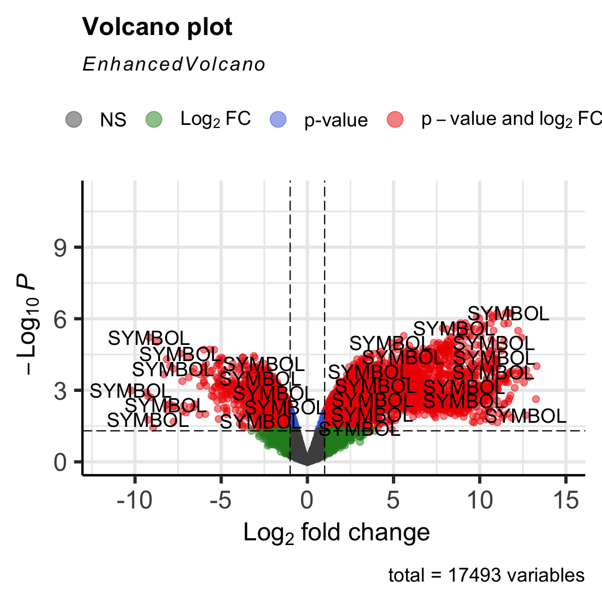
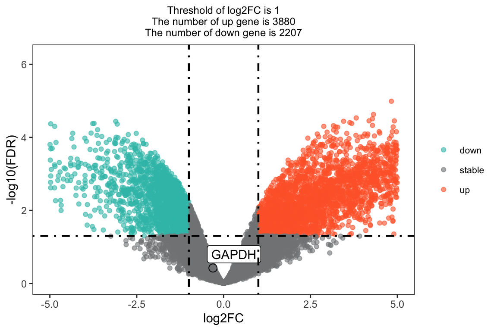
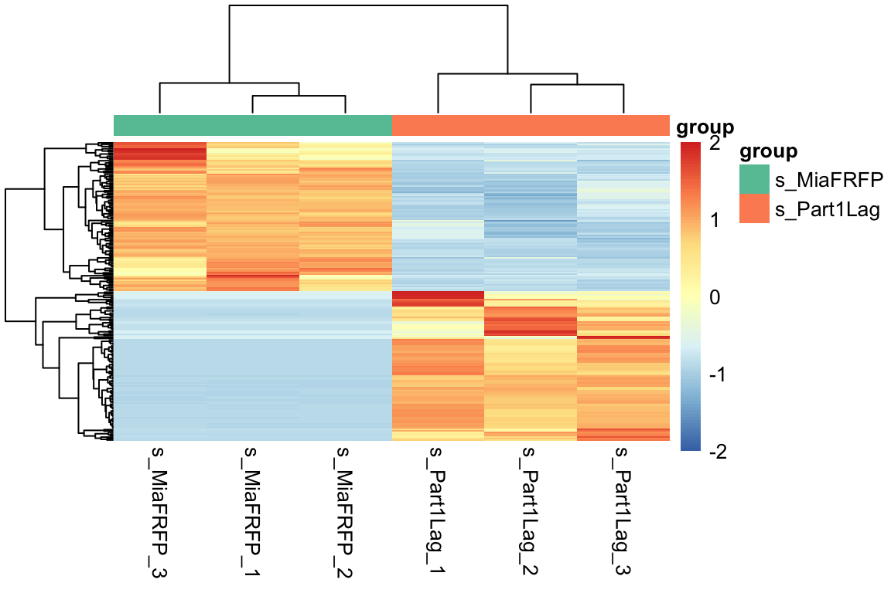

# (PART) 差异基因可视化 {-}


# 差异基因作图

## 加载数据

``` r
# 加载包
library(ggplot2)
# 加载变量
load(file = 'Rdata/symbol_matrix.Rdata') 
load(file = 'Rdata/DEG_edgeR.Rdata')
# 输出文件夹
OUT_FOLDER <- "DEG_ANalysis"
# title
group <- group_list
title <- paste0(levels(group)[1], "_vs_", levels(group)[2])

# 读取差异基因
# cut_log2FC <- mean(abs(total$log2FoldChange)) + 2 * sd(abs(total$log2FoldChange))
# log2FC_t <- ifelse(cut_log2FC > 1, 1, cut_log2FC)
log2FC_t <- 1
sig_t <- 0.05
# 计算 regulation
total$regulation = ifelse(total$FDR > sig_t, 'stable',
                          ifelse(total$log2FoldChange > log2FC_t, 'up',
                                 ifelse(total$log2FoldChange < -log2FC_t, 'down', 'stable')))
# 提取所需的列
nrDEG <-  total[, c("SYMBOL","log2FoldChange", "FDR", "regulation")]
colnames(nrDEG) <- c("SYMBOL", 'log2FC', 'FDR', 'regulation')
```

## 火山图

``` r
res <- nrDEG
library(EnhancedVolcano)
EnhancedVolcano(res,
                x = 'log2FC',
                y = "FDR",
                pCutoff = 0.05,
                lab = "SYMBOL")
```




``` r
library(ggplot2)
nrDEG <- nrDEG

# 创建文本信息
this_tile <- paste0('Threshold of log2FC is ', round(log2FC_t, 3),
                    '\nThe number of up gene is ', nrow(nrDEG[nrDEG$regulation == 'up',]),
                    '\nThe number of down gene is ', nrow(nrDEG[nrDEG$regulation == 'down',]))

# 选择关注的基因，添加标签，以 GAPDH 为例
target_gene = c('GAPDH')
for_label <- dplyr::filter(nrDEG, SYMBOL %in% target_gene)

ggplot(data = nrDEG, aes(x = log2FC, y = -log10(FDR))) +
  geom_point(alpha = 0.6, size = 1.5, aes(color = regulation)) +
  geom_point(size = 3, shape = 1, data = for_label) +
  ggrepel::geom_label_repel(aes(label = (for_label$SYMBOL)), data = for_label,
                            max.overlaps = getOption("ggrepel.max.overlaps", default = 20),
                            color = "black") +
  scale_color_manual(values = c("#34bfb5", "#828586", "#ff6633")) +
  labs(y = "-log10(FDR)") +
  geom_vline(xintercept = c(log2FC_t, -log2FC_t), lty = 4, col = "black", lwd = 0.8) +
  geom_hline(yintercept = -log10(sig_t), lty = 4, col = "black", lwd = 0.8) +
  xlim(-5, 5) +
  theme_bw() +
  ggtitle(this_tile) +
  theme(panel.grid = element_blank(),
        plot.title = element_text(size = 9, hjust = 0.5),
        legend.title = element_blank(),
        legend.text = element_text(size = 8))
```




``` r
deg <- nrDEG
ggplot(data = deg, aes(x = log2FC, y = -log10(FDR))) +
  geom_point(alpha=0.5, size=1, aes(color=regulation)) +
  scale_color_manual(values=c("dodgerblue", "lightgrey", "firebrick"))+
  geom_vline(xintercept=c(-log2FC_t, log2FC_t),lty=4,col="black",linewidth=0.8) +
  geom_hline(yintercept = -log10(sig_t),lty=4,col="black",linewidth=0.8) +
  theme_bw() +
  theme(axis.title = element_text(size=10), 
        plot.title = element_text(size = 10, hjust = 0.5),
        plot.title.position = "plot",
        legend.position = "top",
        legend.text = element_text(size= 8),
        legend.title = element_text(size= 8),
  )
```




## 差异基因热图


``` r
library(pheatmap)
# 提取所需的列
nrDEG = total[, c("SYMBOL","log2FoldChange", "FDR")]
colnames(nrDEG) = c("SYMBOL", 'log2FC', 'FDR')

# 获取上下调前 100 的基因名
x <- nrDEG$log2FC
names(x) <- nrDEG$SYMBOL
cg <- c(names(head(sort(x), 100)), names(tail(sort(x), 100)))

# 数据归一化
dat = log2(edgeR::cpm(symbol_matrix)+1)
n <- t(scale(t(dat[cg, ])))
n[n > 2] = 2
n[n < -2] = -2

# 创建分组信息
ac <- data.frame(group = group_list)
rownames(ac) <- colnames(n)
palette <- RColorBrewer::brewer.pal(3, "Set2")[1:2]
names(palette) <- names(table(group_list))

# 绘制带有分组注释的热图
pheatmap(n, 
         show_colnames = TRUE, 
         show_rownames = FALSE,
         cluster_cols = TRUE,
         annotation_colors = list(group = palette),
         annotation_col = ac, 
         breaks = seq(-2,2, length.out = 100))
```


## 保存结果
保存结果

``` r
write.csv(total, file = paste0(OUT_FOLDER, "/", title, "_all_edger_reg.csv"), row.names = F)
```
保存变量

``` r
save(total, file = "Rdata/DEG_edgeR_reg.Rdata")
```
