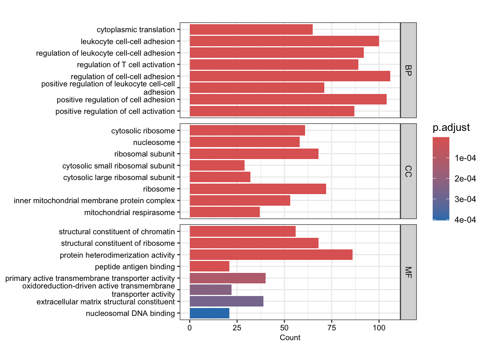
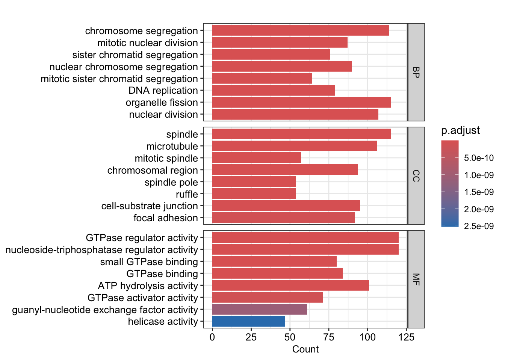
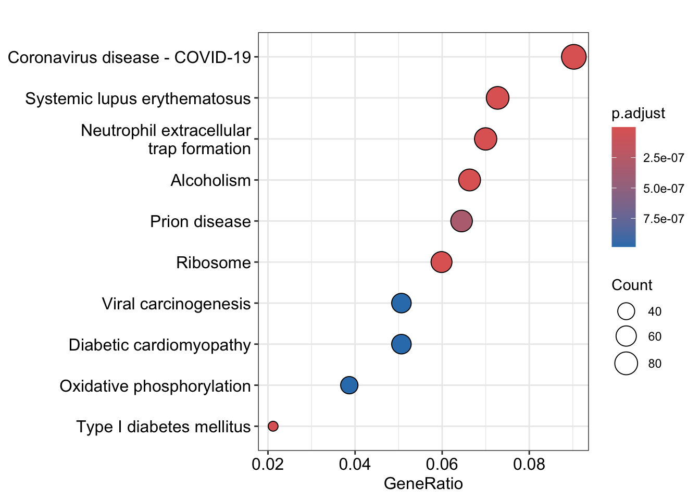
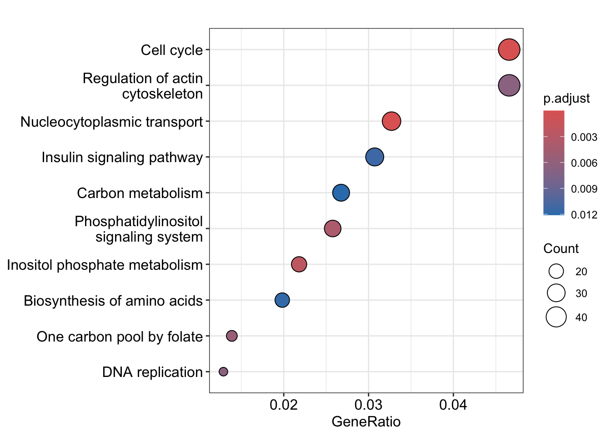
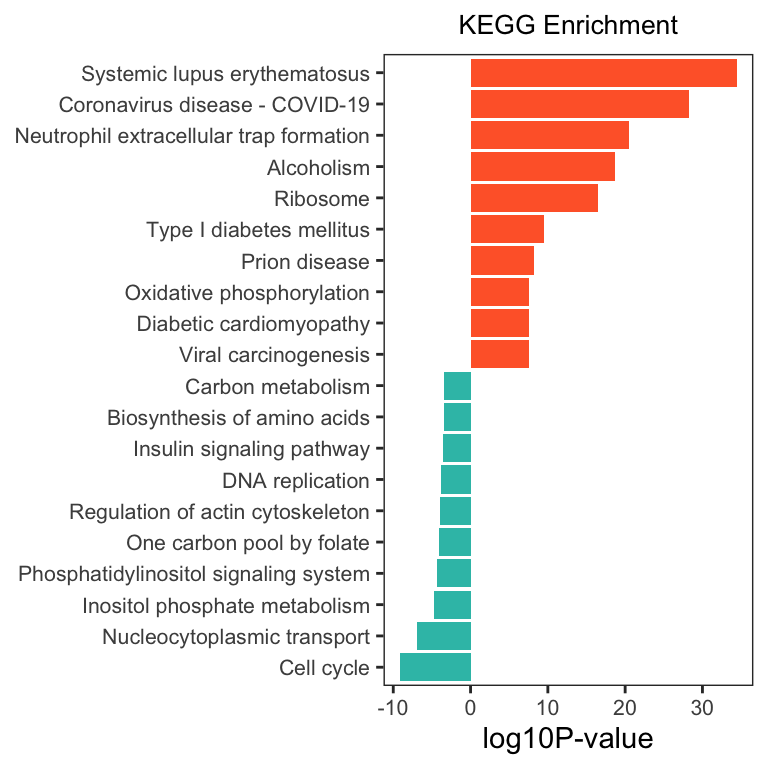

# (PART) 富集分析 {-}


# ORA 富集分析

## 加载数据

``` r
# 加载包
library(org.Hs.eg.db)
library(clusterProfiler)
library(ggplot2)
library(stringr)
library(tidyverse)

load(file = "Rdata/DEG_edgeR_reg.Rdata")
colnames(total)
##  [1] "SYMBOL"         "baseMean"       "baseMeanA"      "baseMeanB"     
##  [5] "foldChange"     "log2FoldChange" "PValue"         "PAdj"          
##  [9] "FDR"            "falsePos"       "s_MiaFRFP_1"    "s_MiaFRFP_2"   
## [13] "s_MiaFRFP_3"    "s_Part1Lag_1"   "s_Part1Lag_2"   "s_Part1Lag_3"  
## [17] "regulation"

gene_up <- total %>%
  filter(regulation == "up")
gene_up <- gene_up$SYMBOL  

gene_down <- total %>%
  filter(regulation == "down")
gene_down <- gene_down$SYMBOL

length(gene_up);length(gene_down)
## [1] 3880
## [1] 2207

gene_up <- as.character(na.omit(AnnotationDbi::select(org.Hs.eg.db,keys = gene_up,columns = 'ENTREZID',keytype = 'SYMBOL')[,2]))
gene_down <- as.character(na.omit(AnnotationDbi::select(org.Hs.eg.db,keys = gene_down,columns = 'ENTREZID',keytype = 'SYMBOL')[,2]))


# 输出文件夹
OUT_FOLDER <- "Anno_enrichment/ORA"
dir.create(OUT_FOLDER, showWarnings = FALSE)
```

## GO 富集分析

``` r
ego <- function(genes, OrgDb, ont="all", pvalueCutoff=0.999, qvalueCutoff=0.999) {
  enriched_go <- enrichGO(gene = genes, 
                          OrgDb = OrgDb,
                          ont = ont, 
                          pvalueCutoff = pvalueCutoff,
                          qvalueCutoff = qvalueCutoff)
  enriched_go <- DOSE::setReadable(enriched_go, OrgDb = OrgDb, keyType = 'ENTREZID')
  return(enriched_go)
}


## up
go_up <- ego(gene_up, OrgDb = "org.Hs.eg.db")

## down
go_down <- ego(gene_down, OrgDb = "org.Hs.eg.db")
```


``` r
## up
barplot(go_up, split="ONTOLOGY", font.size = 8)+ 
  facet_grid(ONTOLOGY~., scale="free") + 
  scale_y_discrete(labels=function(x) str_wrap(x, width=50)) 

## down 
barplot(go_down, split="ONTOLOGY", font.size =10)+ 
  facet_grid(ONTOLOGY~., scale="free") + 
  scale_y_discrete(labels=function(x) str_wrap(x, width=50)) 
```



## KEGG 富集分析

``` r
kk <- function(genes, organism = 'hsa', pvalueCutoff = 0.9, qvalueCutoff = 0.9, OrgDb) {
  enriched_kegg <- enrichKEGG(gene = genes, 
                              organism = organism, 
                              pvalueCutoff = pvalueCutoff, 
                              qvalueCutoff = qvalueCutoff)
  enriched_kegg <- DOSE::setReadable(enriched_kegg, OrgDb = OrgDb, keyType = 'ENTREZID')
  return(enriched_kegg)
}

# up
kk_up <- kk(gene_up, organism = 'hsa', OrgDb = 'org.Hs.eg.db')

# down
kk_down <- kk(gene_down, organism = 'hsa', OrgDb = 'org.Hs.eg.db')
```


``` r
dotplot(kk_up, showCategory=10)
dotplot(kk_down, showCategory=10)
```



将上调和下调的 KEGG 数据合并画图

``` r
up_kegg <- kk_up[kk_up@result$pvalue < 0.01,];up_kegg$group=1
down_kegg <- kk_down[kk_down$pvalue < 0.01,];down_kegg$group=-1
dat <- rbind(head(up_kegg, 10), head(down_kegg, 10))
# 计算负对数 p 值
dat$`-log10PValue` <- -log10(dat$pvalue)* dat$group
# 按照 p 值排序
dat <- dat[order(dat$`-log10PValue`, decreasing = FALSE),]
# 移除描述中的特定字符串
dat$Description <- gsub(' - Mus musculus \\(house mouse\\)', '', dat$Description)

# 使用 ggplot2 绘制图形
ggplot(dat, aes(x = reorder(Description, order(`-log10PValue`, decreasing = FALSE)), y = `-log10PValue`, fill = group)) + 
  geom_bar(stat = "identity") + 
  scale_fill_gradient(low = "#34bfb5", high = "#ff6633", guide = 'none') + 
  labs(x = NULL, y = "log10P-value") +
  coord_flip() + 
  ggtitle("KEGG Enrichment") +
  theme_bw() +
  theme(
    plot.title = element_text(size = 10, hjust = 0.5),  
    axis.text = element_text(size = 8),
    panel.grid = element_blank()
  )
```




## 保存结果
保存结果

``` r
write.csv(go_up, file = paste0(OUT_FOLDER, '/go_up.csv'))
write.csv(go_down, file = paste0(OUT_FOLDER, '/go_down.csv'))
write.csv(kk_up, file = paste0(OUT_FOLDER, '/kegg_up.csv'))
write.csv(kk_down, file = paste0(OUT_FOLDER, '/kegg_down.csv'))
```
保存变量

``` r
save(go_up, go_down, kk_up, kk_down, file = 'Rdata/ORA.Rdata')
```
