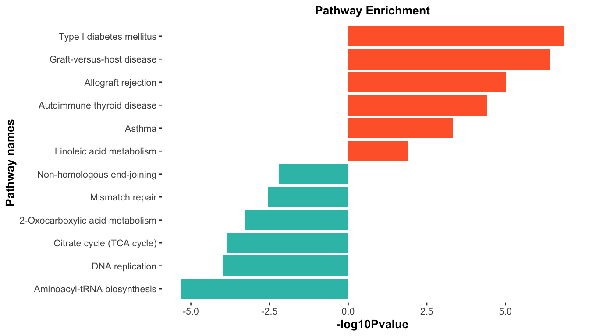
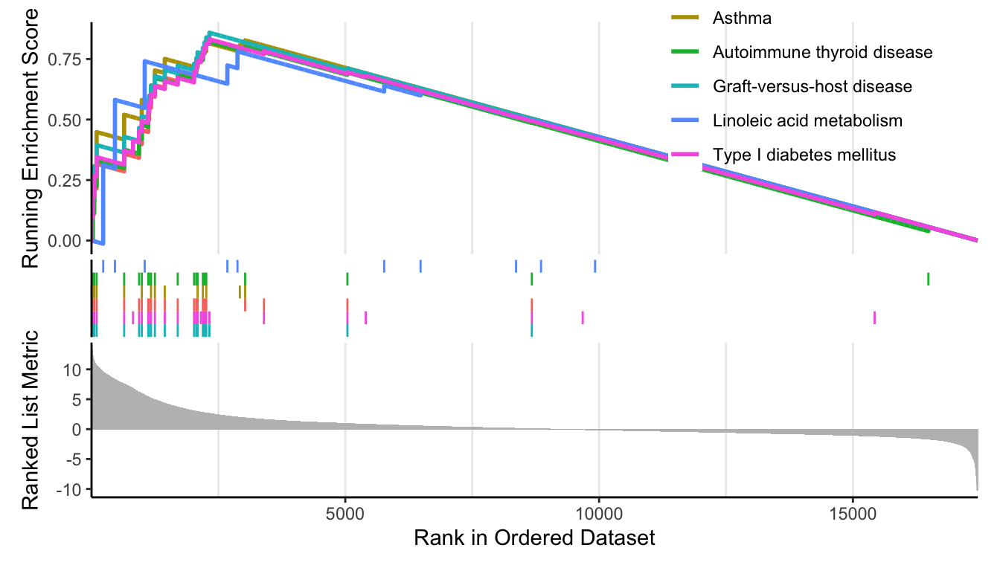
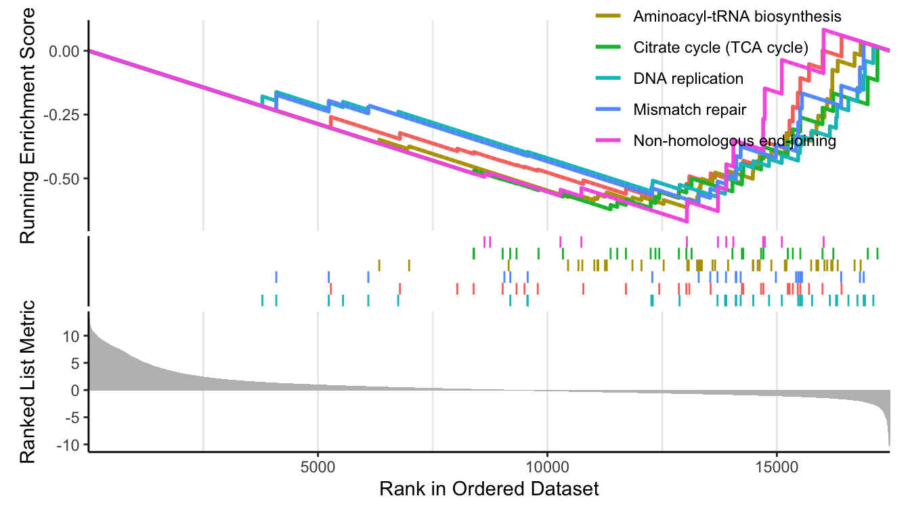

# (PART) 富集分析 {-}


# GSEA 富集分析

## 加载数据

``` r
# 加载包
library(org.Hs.eg.db)
library(clusterProfiler)
library(ggstatsplot)
library(ggplot2)

load(file = "Rdata/DEG_edgeR_reg.Rdata")
colnames(total)
##  [1] "SYMBOL"         "baseMean"       "baseMeanA"      "baseMeanB"     
##  [5] "foldChange"     "log2FoldChange" "PValue"         "PAdj"          
##  [9] "FDR"            "falsePos"       "s_MiaFRFP_1"    "s_MiaFRFP_2"   
## [13] "s_MiaFRFP_3"    "s_Part1Lag_1"   "s_Part1Lag_2"   "s_Part1Lag_3"  
## [17] "regulation"

# 输出文件夹
OUT_FOLDER <- "Anno_enrichment/GSEA"
dir.create(OUT_FOLDER, showWarnings = FALSE)

# 数据预处理
nrDEG <-  total[, c("SYMBOL","log2FoldChange", "FDR")]
colnames(nrDEG) <- c("SYMBOL", 'log2FC', 'FDR')
gene <- bitr(nrDEG$SYMBOL, 
             fromType = "SYMBOL",
             toType =  "ENTREZID",
             OrgDb = org.Hs.eg.db)
head(gene)
##     SYMBOL ENTREZID
## 1 HLA-DQA1     3117
## 2 HLA-DQB2     3120
## 3     LCP1     3936
## 4    CSF1R     1436
## 5    MMP14     4323
## 6      LYZ     4069
head(nrDEG)
##     SYMBOL   log2FC          FDR
## 1 HLA-DQA1 11.68556 5.873859e-07
## 2 HLA-DQB2 10.52826 5.873859e-07
## 3     LCP1 11.80748 5.873859e-07
## 4    CSF1R 11.49362 5.873859e-07
## 5    MMP14 10.99624 5.873859e-07
## 6      LYZ 10.73787 7.767493e-07
nrDEG <- nrDEG[nrDEG$SYMBOL %in% gene$SYMBOL,]
nrDEG$ENTREZID <- gene$ENTREZID[match(nrDEG$SYMBOL, gene$SYMBOL)]

geneList <- nrDEG$log2FC
names(geneList) <- nrDEG$ENTREZID
geneList <- sort(geneList, decreasing = T)
head(geneList)
##    54947     7078     7048     3553   219285    56944 
## 13.29961 13.26271 12.84913 12.69912 12.67004 12.56760
```


## GSEA 分析

``` r
str(geneList)
##  Named num [1:17462] 13.3 13.3 12.8 12.7 12.7 ...
##  - attr(*, "names")= chr [1:17462] "54947" "7078" "7048" "3553" ...
kk_gse <- gseKEGG(geneList     = geneList,
                  organism     = 'hsa',#按需替换
                  minGSSize    = 10,
                  pvalueCutoff = 0.99,
                  verbose      = FALSE)
kk <- DOSE::setReadable(kk_gse, OrgDb='org.Hs.eg.db', # 将基因ID换为SYNBOL
                     keyType='ENTREZID')#按需替换
kk@result$Description <- gsub(' - Mus musculus \\(house mouse\\)',
                           '', kk@result$Description )
head(kk@result$Description)
## [1] "Systemic lupus erythematosus"        "Antigen processing and presentation"
## [3] "Type I diabetes mellitus"            "Graft-versus-host disease"          
## [5] "Leishmaniasis"                       "Staphylococcus aureus infection"
tmp=kk@result 
```


``` r
#～～～取前6个上调通路和6个下调通路～～～
up_k <- kk[head(order(kk$enrichmentScore,decreasing = T)),];up_k$group=1
down_k <- kk[tail(order(kk$enrichmentScore,decreasing = T)),];down_k$group=-1

dat <- rbind(up_k, down_k)

dat$`-log10Pvalue` <- -log10(dat$pvalue)*dat$group
dat <- dat[order(dat$`-log10Pvalue`, decreasing = F),]
ggplot(dat, aes(x=reorder(Description, order(`-log10Pvalue`, decreasing = F)), 
                      y=`-log10Pvalue`, fill=group)) + 
  geom_bar(stat="identity") + 
  scale_fill_gradient(low="#34bfb5",high="#ff6633",guide = FALSE) + 
  labs(x="Pathway names", y="-log10Pvalue") +
  coord_flip() + 
  theme_ggstatsplot()+
  theme(plot.title = element_text(size = 10, hjust = 0.5),  
        axis.text = element_text(size = 8),
        panel.grid = element_blank()
        )+
  ggtitle("Pathway Enrichment")
```




``` r
up_k <- kk[head(order(kk$enrichmentScore,decreasing = T)),];up_k$group=1
down_k <- kk[tail(order(kk$enrichmentScore,decreasing = T)),];down_k$group=-1

p_up <- enrichplot::gseaplot2(kk, geneSetID = head(rownames(up_k)));p_up
```



``` r
p_down <- enrichplot::gseaplot2(kk, geneSetID = head(rownames(down_k)));p_down
```




## 保存结果
保存结果

``` r
write.csv(kk@result, file = file.path(paste0(OUT_FOLDER, '/gsea_kegg.csv')), row.names = F)
```
保存变量

``` r
save(kk, file = 'Rdata/gsea_kk.Rdata')
```
