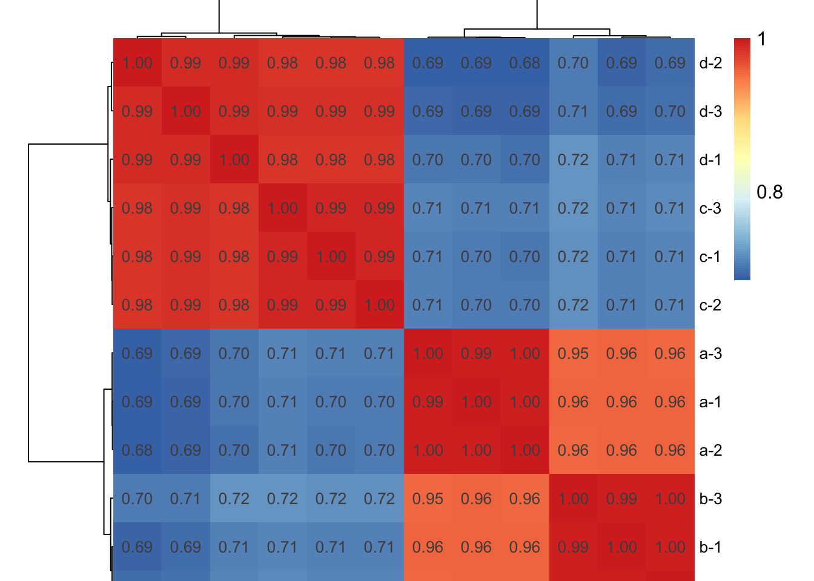

## 生物学重复相关性分析


``` r
library(tidyverse)
```

### 样本间相关性点图

``` r
fpkm_df <- fpkm[rowSums(fpkm >1) > 1,]
fpkm_df <- log10(fpkm_df+1)
```


``` r
dir.create("Expression_Annotation/3_Sample_correlation/", recursive = T)

# 获取样本名列表
sample_names <- colnames(fpkm_df)

# 循环生成每对样本的散点图并保存
for (i in 1:(length(sample_names) - 1)) {
  for (j in (i + 1):length(sample_names)) {
    sample1 <- sample_names[i]
    sample2 <- sample_names[j]
    
    # 提取两个样本的数据
    sample_data <- data.frame(x = fpkm_df[[sample1]], y = fpkm_df[[sample2]])
    
    # 计算相关性
    correlation <- cor(sample_data$x, sample_data$y)
    
    # 生成散点图
    scatter_plot <- ggplot(sample_data, aes(x = x, y = y)) +
      geom_point(alpha = 0.6) +
      geom_smooth(method = "lm", se = FALSE, color = "blue") +  # 添加线性拟合曲线
      theme_bw() +  # 使用简洁主题
      theme(
        axis.title.x = element_text(size = 14, face = "bold"),
        axis.title.y = element_text(size = 14, face = "bold"),
        plot.title = element_text(hjust = 0.5, size = 16, face = "bold"),  # 标题居中且加粗
        axis.text = element_text(size = 12),  # 轴文字字体大小
        panel.grid.major = element_blank(),  # 去掉主要网格线
        panel.grid.minor = element_blank()   # 去掉次要网格线
      ) +
      labs(title = paste("Scatter Plot of", sample1, "vs", sample2),
           x = paste("log2(FPKM+1) of", sample1), 
           y = paste("log2(FPKM+1) of", sample2)) +
      annotate("text", x = min(sample_data$x, na.rm = TRUE), y = max(sample_data$y, na.rm = TRUE),
               label = paste("Correlation:", round(correlation, 2)), 
               hjust = -0.2, vjust = 1.1, size = 5, color = "black", fontface = "bold")  # 显示相关性值
    
    # 保存散点图
    
    ggsave(plot = scatter_plot, 
           filename = paste0("./Expression_Annotation/3_Sample_correlation/",
                             sample1, "_vs_", sample2, "_cor.pdf"), 
           width = 6, 
           height = 6)
  }
}
```


### 样本间相关性热图


``` r
# 安装并加载必要的包
library(pheatmap)

# 计算样本间的相关性矩阵
correlation_matrix <- cor(fpkm_df)

# 生成相关性热图
library(RColorBrewer)
All_phe <- pheatmap(correlation_matrix, 
         cluster_rows = TRUE, 
         cluster_cols = TRUE,
         display_numbers = TRUE,  # 显示相关性数值
         number_format = "%.2f",  # 数值格式为小数点后两位
         fontsize_number = 10,    # 数值字体大小
         main = "Sample Correlation Heatmap",  # 图标题
         fontsize = 12,  # 整体字体大小
         fontsize_row = 10,  # 行字体大小
         fontsize_col = 10,  # 列字体大小
         border_color = NA,  # 不显示边框
         cellwidth = 30,  # 单元格宽度
         cellheight = 30,  # 单元格高度
         legend_breaks = seq(-1, 1, by = 0.2),  # 图例刻度
         legend_labels = seq(-1, 1, by = 0.2))  # 图例标签
```



``` r

dir.create("Expression_Annotation/3_Sample_correlation/", recursive = T)
ggsave(plot = All_phe, filename = "./Expression_Annotation/3_Sample_correlation/sample_cluster.pdf", width = 7, height = 7)
```


### 样本 PCA


``` r
# 安装并加载必要的包
library(FactoMineR)
library(factoextra)

# 进行PCA分析
pca_result <- PCA(t(fpkm_df), graph = FALSE)

# 分组组信息
groups <- factor(group$group)

# 绘制PCA图
All_PCA <- fviz_pca_ind(pca_result,
             geom.ind = "point",  #c( "point", "text" )
             col.ind = groups,
             addEllipses = T,
             ellipse.level = 0.95,
             repel = T,
             legend.title = "Groups"
             ) + 
  ggtitle("PCA Plot with Groups") +
  theme_bw()+
  theme(plot.title = element_text(size=12,hjust = 0.5)
        )

dir.create("Expression_Annotation/4_PCA/", recursive = T)
ggsave(plot = All_PCA, filename = "./Expression_Annotation/4_PCA/All_sample_PCA.pdf", width = 5, height = 5)
```


``` r
# 绘制各组的PCA图
for (group_name in names(group_compare)) {
  selected_groups <- group_compare[[group_name]]
  selected_samples <- which(groups %in% selected_groups)
  selected_data <- fpkm_df[, selected_samples]
  selected_pca <- PCA(t(selected_data), graph = FALSE)
  selected_labels <- groups[selected_samples]
  
  pca_plot <- fviz_pca_ind(selected_pca,
                           geom.ind = "point",
                           col.ind = selected_labels,
                           addEllipses = TRUE,
                           ellipse.level = 0.95,
                           repel = TRUE,
                           legend.title = "Groups"
                           ) + 
    ggtitle(paste("PCA Plot of", group_name)) +
    theme_bw() +
    theme(plot.title = element_text(size = 12, hjust = 0.5))
  
  ggsave(plot = pca_plot, filename = paste0("./Expression_Annotation/4_PCA/", group_name, "_PCA.pdf"), width = 5, height = 4)
}
```


