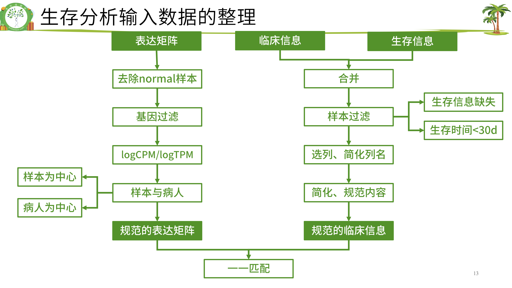

# TCGA 生存分析


### 临床信息下载

查看 TGGA 项目

``` r
# 加载包
library(TCGAbiolinks)
library(stringr)
library(SummarizedExperiment)

getGDCprojects()$project_id %>% str_subset("TCGA")
proj = "TCGA-PAAD"
```

下载临床数据

``` r
f2 = paste0(proj,"clf.Rdata")
if(!file.exists(f2)){
  query = GDCquery(project = proj, 
                   data.category = "Clinical",
                   data.type = "Clinical Supplement",
                   data.format = "BCR XML"
  )
  GDCdownload(query)
  dat = GDCprepare_clinic(query, clinical.info = "patient") 
  k = apply(dat, 2, function(x){!all(is.na(x))});table(k)
  clinical = dat[,k]
  save(clinical,file = f2)
}
load(f2)
```

### 生存信息下载
xena 单独整理了生存信息，可以使用它的数据
https://shixiangwang.github.io/home/en/tools/ucscxenatools-intro/

``` r
library(UCSCXenaTools)
library(dplyr)

cohort <- XenaData %>% 
  filter(XenaHostNames == "tcgaHub") %>% # select TCGA Hub
  XenaScan("PAAD")

cli_query <- cohort %>% 
  filter(DataSubtype == "phenotype") %>%  # select clinical dataset
  XenaGenerate() %>%  # generate a XenaHub object
  XenaQuery() %>% 
  XenaDownload()

cli <- XenaPrepare(cli_query)
surv <- cli[[2]]
```

## 合并生存信息和临床信息


``` r
meta <- left_join(surv, clinical, by = c("_PATIENT"= "bcr_patient_barcode"))
nrow(meta)
length(unique(meta$sample))
meta <- distinct(meta, sample, .keep_all = T)
```

#### 样本过滤
去掉生存信息不全或者生存时间小于30天的样本，样本标准不唯一，且差别很大

``` r
k1 <- meta$OS.time >= 30;table(k1)
k2 <- !(is.na(meta$OS.time)|is.na(meta$OS));table(k2)
meta <- meta[k1&k2,]
```

#### 规范列名
选择需要的列，简化列名

``` r
tmp <- data.frame(colnames(meta))

meta <- meta[,c(
  'sample', # 样本 ID
  'OS', # 结局事件
  'OS.time', # 从生存期
  'race_list', # 种族
  'age_at_initial_pathologic_diagnosis', # 年龄
  'gender' , # 性别
  'stage_event_pathologic_stage' # 病理分期
)]
colnames(meta)=c('ID','event','time','race','age','gender','stage')
str(meta)

meta$gender = as.character(meta$gender)
meta$stage = as.character(meta$stage)
meta$race = as.character(meta$race)
```

#### 简化、规范内容

(1) 结局事件
生存分析的输入数据里，要求结局事件必须用0和1表示，1表示阳性结局。
xena的数据是整理好的，其他来源的需要自行检查和整理。

``` r
table(meta$event)
# a = c("Dead", "Dead", "Alive", "Dead", "Alive")
# ifelse(a=="Alive",0,1)
```

(2) 生存时间
认清生存时间的单位（通常是月，也可以用天和年）;

``` r
range(meta$time)
meta$time = meta$time/30.44
range(meta$time)
```

(3) 检查各列的信息是否规范
没有冗余信息,缺失的信息用NA代替

``` r
library(stringr)

meta[meta==""] = NA
table(meta$stage)

meta$stage <- meta$stage %>% 
  stringr::str_remove("Stage ")

table(meta$stage, useNA = "always")
table(meta$race,useNA = "always")
table(meta$gender,useNA = "always")
str(meta)
```


## 表达数据下载
下载表达矩阵

``` r
proj = "TCGA-PAAD"
f1 = paste0(proj, "expf.Rdata")
if(!file.exists(f1)){
  query = GDCquery(project = proj, 
                 data.category = "Transcriptome Profiling",
                 data.type = "Gene Expression Quantification", 
                 workflow.type = "STAR - Counts",
)
  GDCdownload(query)
  dat = GDCprepare(query) # 创建 SummarizedExperiment 对象
  exp = assay(dat) # 提取表达矩阵
  tpm = assay(dat,4) # 提取 TPM 矩阵
  save(exp, tpm, file = f1)
}
load(f1)

# 若生存分析使用 TPM （可选）
exp <- tpm
```

### 转换为 SYMBOL ID
表达矩阵行名转换为 SYMBOL ID

``` r
library(tinyarray)
exp = trans_exp_new(exp)
exp[1:4,1:4]
```

### 去除 normal 样本
表达矩阵只需要tumor数据，不要normal，将其去掉，新表达矩阵数据命名为 exprSet。
临床信息需要进一步整理，成为生存分析需要的格式，新临床信息数据命名为 meta。
由于不同癌症的临床信息表格列名可能不同，这里的代码需要根据实际情况修改。

分组信息获取

``` r
# 根据样本ID的第14-15位，给样本分组（tumor和normal）
Group = make_tcga_group(exp)
table(Group)

exprSet = exp[,Group=='tumor']
ncol(exp)
ncol(exprSet)
```

### 基因过滤
(1)标准1：至少要在50%的样本里表达量大于0（最低标准）。
exp(600样本)满足“至少在300个样本里表达量>0”,不能等同于 exprSet(500样本)满足“至少在250个样本里表达量>0”。

``` r
k = apply(exprSet,1, function(x){sum(x>0)>0.5*ncol(exprSet)});table(k)
exprSet = exprSet[k,]
nrow(exprSet)

```

(2)标准2：至少在一半以上样本里表达量＞10(其他数字也可，酌情调整)

``` r
k = apply(exprSet,1, function(x){sum(x>10)>0.5*ncol(exprSet)});table(k)
exprSet = exprSet[k,]
nrow(exprSet)
```


### 使用 logCPM 或 logTPM 数据

``` r
# 若上述没有使用 TPM 矩阵，则使用这个代码 
# exprSet[1:4,1:4]
# exprSet <- log2(edgeR::cpm(exprSet)+1)
# exprSet[1:4,1:4]

# 若上述使用了 TPM 矩阵，则使用这个代码
exprSet[1:4,1:4]
exprSet <- log2(exprSet+1)
exprSet[1:4,1:4]
```

### 样本与病人信息整理

有的病人会有两个或两个以上的肿瘤样本，就有重复。两种可行的办法：
(1) 以病人为中心，对表达矩阵的列按照病人ID去重复，每个病人只保留一个样本。

``` r
exprSet = exprSet[,sort(colnames(exprSet))]
k = !duplicated(str_sub(colnames(exprSet),1,12));table(k)
exprSet = exprSet[,k] 
ncol(exprSet)
```
(2) 以样本为中心，如果每个病人有多个样本则全部保留。(删掉上面这一段代码即可)


## 表达矩阵与临床信息匹配
即：meta的每一行与exprSet每一列一一对应

``` r
rownames(meta) <- meta$ID

head(rownames(meta))
head(colnames(exprSet))

colnames(exprSet) <- str_sub(colnames(exprSet),1,15)
s <- intersect(rownames(meta),colnames(exprSet));length(s)
exprSet <- exprSet[,s]
meta <- meta[s,]
rownames(meta) <- meta$ID

dim(exprSet)
dim(meta)

identical(rownames(meta), colnames(exprSet))

save(meta, exprSet, proj, file = paste0("Rdata/", proj,"_sur_model.Rdata"))
```


## 生存分析

``` r
rm(list = ls())
proj = "TCGA-PAAD"
load("Rdata/", paste0(proj,"_sur_model.Rdata"))
exprSet[1:4,1:4]
str(meta)
```

### 二分量

``` r
library(survival)
library(survminer)
sfit <- survfit(Surv(time, event)~gender, data=meta)
ggsurvplot(sfit,pval=TRUE)

ggsurvplot(
      sfit, 
      data = meta, 
      pval = TRUE, 
      risk.table = TRUE, 
      # title = ,
      legend.labs = c("male", "female")
    )

```


### 连续型变量
#### 年龄

``` r

group <- ifelse(meta$age > median(meta$age, na.rm = T),"older","younger")
table(group)

sfit=survfit(Surv(time, event)~group, data=meta)
ggsurvplot(sfit,pval =TRUE, data = meta, risk.table = TRUE)
```


``` r
#最佳截断值-年龄
# 通过遍历所有可能的分割点，计算每个分割点对应的统计量（如 log-rank 统计量），然后选择使统计量最大的分割点。
cut <- surv_cutpoint(meta, time = "time", event = "event",
                    variables = "age")
m <- cut[["cutpoint"]][1, 1]
group <- ifelse(meta$age > m,"older","younger")
table(group)
sfit <- survfit(Surv(time, event)~group, data=meta)
ggsurvplot(sfit,pval =TRUE, data = meta, risk.table = TRUE)
```

#### 基因

``` r
# 中位数截断
g <- rownames(exprSet)[1];g
meta$gene <- ifelse(exprSet[g,] > median(exprSet[g,]),'high','low')

sfit <- survfit(Surv(time, event)~gene, data=meta)
ggsurvplot(
  sfit, 
  data = meta, 
  pval = TRUE, 
  risk.table = TRUE, 
  title = paste("Survival Curve for", g),
  legend.labs = c("High Expression", "Low Expression")
)
```


``` r
#最佳截断值-基因
dat <- meta
dat$gene2 = exprSet[g,]
cut = surv_cutpoint(dat, time = "time", event = "event", 
                    variables = "gene2")
m = cut[["cutpoint"]][1, 1]

dat$gene = ifelse(exprSet[g,]>m,'high','low')
table(dat$gene)

sfit=survfit(Surv(time, event)~gene, data=dat)
ggsurvplot(sfit,pval =TRUE, data = dat, risk.table = TRUE)
```


### log-rank test
KM的p值是log-rank test得出的，可以批量操作


``` r
# KM_cox_function.R
geneKM <- function(gene){
  meta$group=ifelse(gene>median(gene),'high','low')  
  data.survdiff=survdiff(Surv(time, event)~group,data=meta)
  p.val = 1 - pchisq(data.survdiff$chisq, length(data.survdiff$n) - 1)
  return(p.val)
}
genecox <- function(gene){
  meta$gene = gene
  #可直接使用连续型变量
  m = coxph(Surv(time, event) ~ gene, data =  meta)
  #也可使用二分类变量
  #meta$group=ifelse(gene>median(gene),'high','low') 
  #meta$group = factor(meta$group,levels = c("low","high"))
  #m=coxph(Surv(time, event) ~ group, data =  meta)
  
  beta <- coef(m)
  se <- sqrt(diag(vcov(m)))
  HR <- exp(beta)
  HRse <- HR * se
  
  #summary(m)
  tmp <- round(cbind(coef = beta, 
                     se = se, z = beta/se, 
                     p = 1 - pchisq((beta/se)^2, 1),
                     HR = HR, HRse = HRse,
                     HRz = (HR - 1) / HRse, 
                     HRp = 1 - pchisq(((HR - 1)/HRse)^2, 1),
                     HRCILL = exp(beta - qnorm(.975, 0, 1) * se),
                     HRCIUL = exp(beta + qnorm(.975, 0, 1) * se)), 3)
  
  return(tmp['gene',]) 
  #return(tmp['grouphigh',])#二分类变量
}
```


``` r
# source("KM_cox_function.R")
logrankfile <- paste0(proj,"_log_rank_p.Rdata")
if(!file.exists(logrankfile)){
  log_rank_p <- apply(exprSet , 1 , geneKM)
  log_rank_p <- sort(log_rank_p)
  save(log_rank_p, file = logrankfile)
}
load(logrankfile)
head(log_rank_p)
log_rank <- as.data.frame(log_rank_p) %>% 
  rownames_to_column(var = "gene") %>% 
  arrange(log_rank_p)

table(log_rank_p < 0.01) 
table(log_rank_p < 0.05) 
```

### 批量单因素 cox

``` r
coxfile <- paste0(proj,"_cox.Rdata")
if(!file.exists(coxfile)){
  cox_results <-apply(exprSet , 1 , genecox)
  cox_results=as.data.frame(t(cox_results))
  save(cox_results,file = coxfile)
}
load(coxfile)
table(cox_results$p<0.01)
table(cox_results$p<0.05)

lr = names(log_rank_p)[log_rank_p<0.01];length(lr)
cox = rownames(cox_results)[cox_results$p<0.01];length(cox)
length(intersect(lr,cox))
# save(lr,cox,file = paste0(proj,"_logrank_cox_gene.Rdata"))
```

可参考教程：
https://www.bilibili.com/video/BV15J4m1V7Mi?spm_id_from=333.788.videopod.sections&vd_source=2fc0eac1995e2bcd209e8b17b7174cd8

https://mp.weixin.qq.com/s/bdShnFvdPIBRYD-whgDfJg

https://mp.weixin.qq.com/s?__biz=MzUzMTEwODk0Ng==&mid=2247533032&idx=1&sn=3314f754aafd494cd7d7ec676938b6fa&chksm=fa4584d5cd320dc3193932ae91cfe7122d2beb7eb4d9d083817a28a14af0f67d65f70a13969d&scene=178&cur_album_id=3449098504616853513#rd
